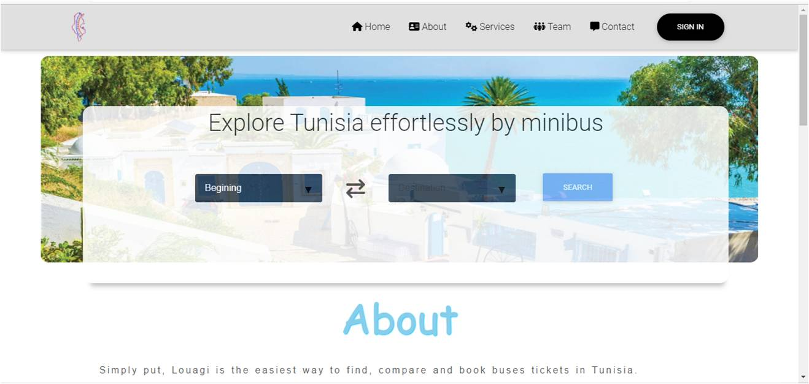

<h2 align="center"> LOUAGI </h2>

## Description :speech_balloon:
Louagi is a plaform in which you can buy minibus ticket, Louagi runs on a Python Flask app serving HTML using WSGI module of apache server 2.4.41
### Back-End :
<a href="https://github.com/mking94/Louagi/blob/main/index.py" >Index.py </a>: Entry point of the Flask app

## Front-End :high_brightness:
* [templates/index.html](./static/templates/home.html): HTML for home page.
* [templates/dash.html](./static/templates/dash.html): HTML Dashboard page.
* [static/css](./static/css): Folder of CSS3 styling.
## Dependencies :couple:

| Library    | Version |
| ---------- | ------- |
| Python     | 3.7.3   |
| Flask      | 1.0.2   |
| Apache     | 2.4.41  |

## Installation :running:
<b> 1-Install apache2 </b>

$ apt install apache2

<b> 2-Install python3 </b>

$ apt install python3

<b> 3-Install module WSGI for apache2 </b>

$ apt install libapache2-mod-wsgi-py3

<b> 4-Install mongodb </b>

$ apt install mongodb

<b> 5-Install module pymongo for python3 </b>

$ pip install pymongo

<b> 5-Create data dtabase louagi </b>
## Usage :
<b>Clone repository:</b>

$ cd /var/www/html

$ git clone https://github.com/mking94/Louagi.git

## Author :black_nib:
* __Maher Ben Dada__ <[Maher](https://github.com/mking94)>
